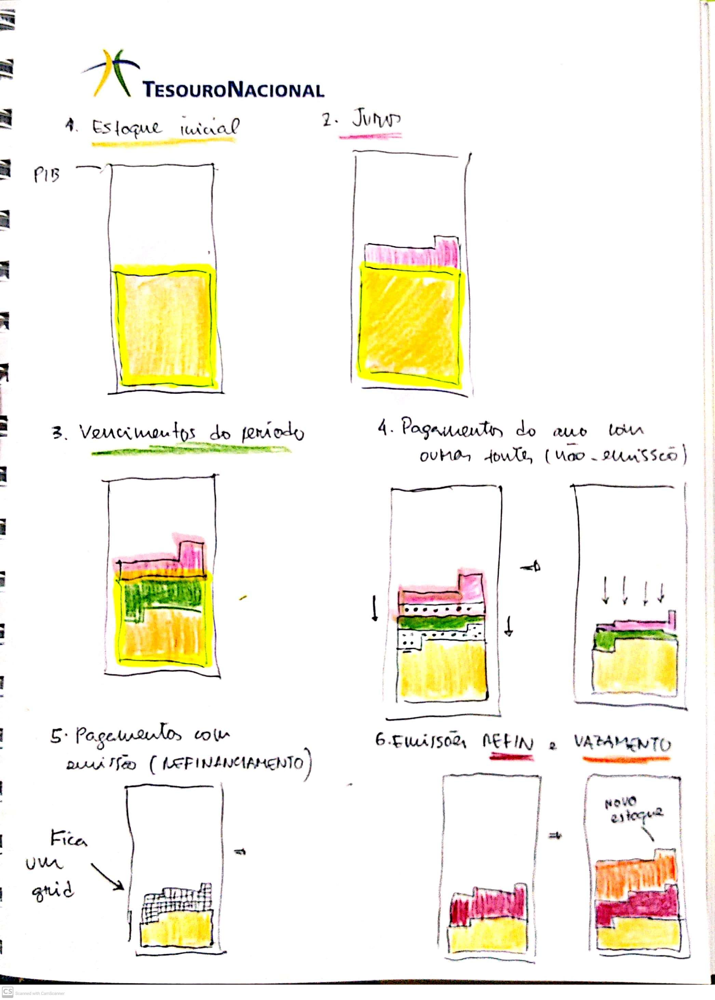

# Dívida

Este projeto, que nasceu como um projeto para criação de uma versão mais interativa e interessante do Relatório Mensal da Dívida (RMD), busca explicar as informações essenciais da dívida pública de uma forma simples, direta e interessante (hopefully).

### To-do

Verificar questões de acessibilidade. Botões, por exemplo.

### Inspirações

https://www.nytimes.com/interactive/2018/05/09/nyregion/subway-crisis-mta-decisions-signals-rules.html

https://datalab.usaspending.gov/americas-finance-guide/debt/


### Sketch



### Comentários

Referencial: 

```

y  |  x

...
---+----+----+----+----+----+----+----+----+----+----|
04 |  1 |  2 |  3 |  4 |  5 |  6 |  7 |  8 |  9 | 10 |
---+----+----+----+----+----+----+----+----+----+----|
03 |  1 |  2 |  3 |  4 |  5 |  6 |  7 |  8 |  9 | 10 |
---+----+----+----+----+----+----+----+----+----+----|
02 |  1 |  2 |  3 |  4 |  5 |  6 |  7 |  8 |  9 | 10 |
---+----+----+----+----+----+----+----+----+----+----|
01 |  1 |  2 |  3 |  4 |  5 |  6 |  7 |  8 |  9 | 10 |
---+----+----+----+----+----+----+----+----+----+----|


```

Sempre assumiremos que os pagamentos vão começar do primeiro elemento à esquerda de determinada linha. Com isso, em qualquer caso sempre teremos `n` linhas completas removidas, e no máximo `1` linha incompleta restante.


E agora, fazer com greensock ou d3 puro?

## Greensock

```js

const cont = d3.select(".svg-container");

cont             
    .selectAll("div.rect")
    .data(vis.data.divida, d => d.unidade)
    .join("div")
    .classed("rect", true)
    .style("position", "absolute")
    .style("background-color", "coral")
    .style("left", d => vis.draw.components.scales.x(d.pos_x) + "px" )
    .style("top", d => vis.draw.components.scales.y(d.pos_y) +"px" )
    .style("width", vis.params.unidade.tamanho + "px")
    .style("height", vis.params.unidade.tamanho + "px")
    .style("transform", "scale(0)");

let anim = new TimelineLite({paused: true});

anim.staggerTo("div.rect", 1, {
  scale: 1,
  ease: Back.easeOut,
  stagger: {
    grid: "auto",
    from: "start",
    axis: "y",
    each: 0.08
  }
});

anim.play(0);
anim.reverse();

```

Parti para uma solução mais direta, sem ser tão genérica.


Cria divs refin: 

```js
vis.render.cria_divs('emissao_refin');


document.querySelectorAll('[data-tipo="emissao_refin"]').forEach(el => el.style.top = vis.render.components.scales.y(el.dataset.pos_y_emissao) + 'px')

```

Lá no desloca, poderia deixar com uma opção de marcar os quadradinhos que vão ser deslocados, e deslocar sempre para a 'pos_y'. Aí no cálculo dos pagamentos, incluir a posição anterior ao pagamento como 'pos_y_anterior', passando esse 'tipo_pos_y' na chamada da funcão `cria_divs`.
